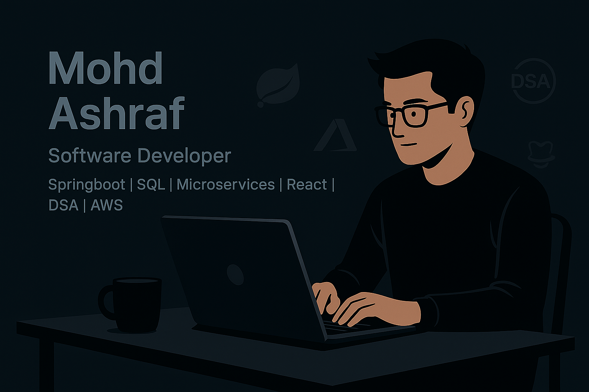

# 👋 Hey there, I'm Mohd Ashraf!

<div align="center">
  
</div>

<div align="center">
  
</div>

<div align="center">

  [](https://github.com/mohdashraf1234)
  [](https://github.com/mohdashraf1234)
  [](https://github.com/mohdashraf1234)
</div>

---

## 🧠 About Me

```javascript
const mohdAshraf = {
  pronouns: "He/Him",
  location: "Noida, India 🇮🇳",
  currentFocus: "Java, Spring Boot, Microservices, SQL, and Cloud Technologies",
  funFact: "I debug with System.out.println() and I’m proud of it! 😄",
  askMeAbout: ["Java", "Spring Boot", "Microservices", "SQL", "React", "AWS", "DSA"],
  technologies: {
    backend: ["Java", "Spring Boot", "Spring MVC", "Hibernate", "RESTful APIs", "Microservices"],
    frontend: ["HTML5", "CSS3", "JavaScript", "React.js", "Bootstrap", "Thymeleaf"],
    databases: ["MySQL", "PostgreSQL", "Oracle", "SQL"],
    tools: ["Git", "GitHub", "Postman", "Eclipse", "VS Code", "Docker", "Kafka", "RabbitMQ", "AWS"],
  },
  currentlyLearning: ["System Design", "Advanced DSA", "DevOps & CI/CD", "Cloud Architecture (AWS)"]
};
````

---

## 🌐 Connect With Me

<div align="center">

[](https://www.linkedin.com/in/mohd-ashraff)
[](https://github.com/mohdashraf1234)
[](https://leetcode.com/u/a_cube___/)
[](https://mohdashraf1234.github.io/PortfolioB/)

</div>

---

## 💻 Technical Skills

### 🚀 Languages & Frameworks

<div align="center">


</div>

### 🧩 Databases & Cloud

<div align="center">


</div>

### ⚙️ Tools & Platforms

<div align="center">


</div>

---

## 🏗️ Featured Projects

<div align="center">

| Project                               | Description                                                                  | Tech Stack                                                       | Links                                                                   |
| ------------------------------------- | ---------------------------------------------------------------------------- | ---------------------------------------------------------------- | ----------------------------------------------------------------------- |
| 🏨 **Hotel Rating Management System** | Scalable microservices system for managing users, resorts & ratings.         | Java, Spring Boot, Microservices, JWT, Spring Security, MySQL    | [GitHub](https://github.com/mohdashraf1234/HotelRatingManagementSystem) |
| ☁️ **Smart Cloud-based Contact App**  | Full-stack contact manager with Razorpay integration.                        | Java, Spring Boot, Thymeleaf, MySQL, Bootstrap, Razorpay         | [GitHub](https://github.com/mohdashraf1234)                             |
| 🧾 **Bill Project**                   | Backend system with 150+ JasperReports (.jrxml) for credit/debit operations. | Java 8, Spring Boot, Microservices, Hibernate, MySQL, JasperSoft | —                                                                       |
| 🏦 **National Bank of Egypt**         | Banking solution with cheque scanning, fraud detection & REST APIs.          | Java, Spring Boot, MySQL, Finacle Integration, HTML, CSS, JS     | —                                                                       |
| 🌐 **Portfolio Website**              | Personal responsive portfolio website.                                       | HTML, CSS, JS                                                    | [Live](https://mohdashraf1234.github.io/PortfolioB/)                    |

</div>

---

## 📊 GitHub Analytics

<div align="center">

  
  

</div>

<div align="center">

  

</div>

<div align="center">

  

</div>

---

## 🎯 Current Focus

```yaml
Learning:
  - System Design Fundamentals
  - DevOps  & CI/CD
  - Advanced DSA & Problem Solving
  - AWS Cloud Services

Goals_2025:
  - Build scalable enterprise-grade applications
  - 500 Leetccode  Problems
  - Achieve deeper expertise in System Design
```

---

## 🏆 GitHub Trophies

<div align="center">

  

</div>

---

## 💬 Random Dev Quote

<div align="center">

  

</div>

---

## 🤝 Let's Collaborate!

I’m always open to:

* 💡 Sharing knowledge or working on new Java/Spring Boot projects
* 🚀 Collaborating on backend systems or cloud apps
* 🌟 Contributing to open-source initiatives
* 🧠 Solving real-world software engineering problems

📩 Reach me on [LinkedIn](https://www.linkedin.com/in/mohd-ashraff) or check out my [Portfolio](https://mohdashraf1234.github.io/PortfolioB/).

---

<div align="center">

**Thanks for visiting my profile! Have a great day! 🌟**

  

</div>

---

<div align="center">

⭐️ From [Mohd Ashraf](https://github.com/mohdashraf1234)

</div>
